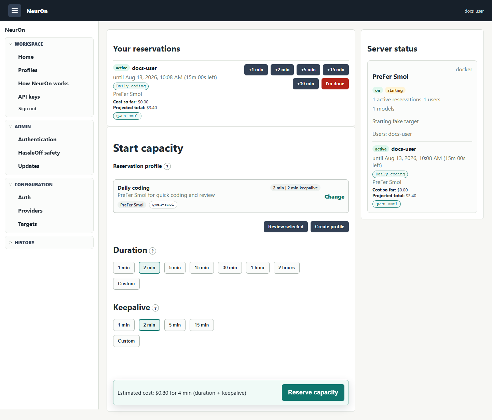
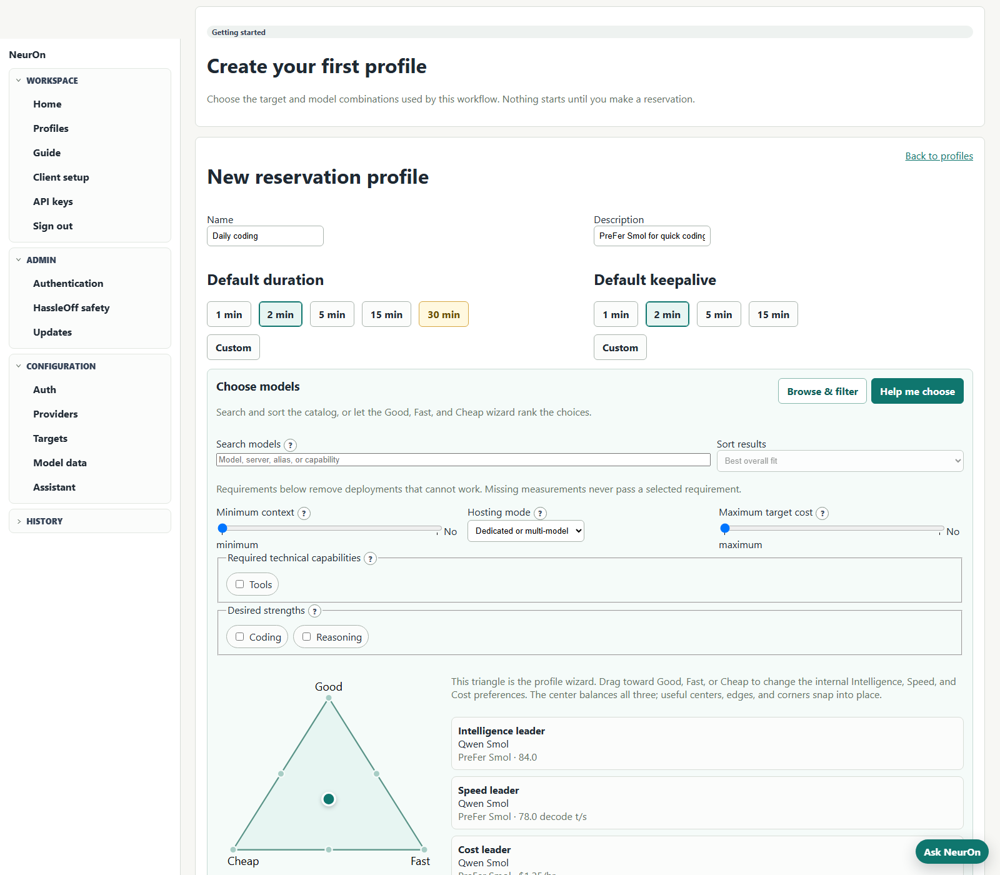

# NeurOn

[](https://www.gnu.org/licenses/agpl-3.0)

NeurOn is a lightweight control plane for shared, self-hosted LLM capacity. A
developer reserves the targets and models they intend to use; NeurOn keeps the
matching runtime available while that demand or recent traffic exists, then
lets the expensive capacity turn off.



The dedicated profile builder filters exact target/model deployments by hard
requirements, ranks and reorders the rest with the Good/Fast/Cheap triangle,
and exposes context, technical flags, measured speed, intelligence, scored
strengths, quality retention, cost, popularity, favorites, and LiteLLM aliases
behind each choice.



## How it works

1. An operator connects existing or explicitly provisionable runtime capacity
   as a target.
2. A user saves a profile containing one or more target-and-model selections.
3. The user reserves that profile for a duration and chooses a traffic
   keepalive window.
4. The reconciler aggregates everybody's demand, starts each required target,
   keeps it available while it is still needed, and stops it only after demand
   is gone.

Several users and reservations can safely overlap on the same target. A single
profile can also reserve multiple target/model combinations for workflows that
need more than one backend. Activation history records estimated runtime cost
and attributes it to the real reservations that participated, including the
traffic-only tail after their requested windows end.

For a guided product tour, see the [User guide](control-plane/docs/user-guide.md).

## What NeurOn owns

NeurOn owns reservation intent and the control loop around runtime capacity. It
does **not** bundle an inference image, download models, tune a runtime, or
silently create general cloud infrastructure. Runtime behavior belongs in the
external runtime project and target configuration.

| Provider | Normal lifecycle | Resource creation |
| --- | --- | --- |
| Docker container | Starts/stops a named container | Optional, explicit admin provisioning when an image is configured |
| Docker Compose | Starts/stops an existing service | No image builds or model downloads |
| AWS EC2 | Starts/stops **one pre-created instance** | Not implemented; NeurOn does not create EC2, AMIs, VPCs, security groups, roles, or volumes |
| AWS ECS/ASG | Changes desired counts on existing ECS/ASG resources | Does not create clusters, services, ASGs, launch templates, or AMIs |
| RunPod | Starts/stops an existing Pod | Optional, explicit admin provisioning when enabled |
| Upstream NeurOn | Holds/releases an upstream reservation | No upstream provisioning |

Provider details and least-privilege examples are in
[Providers](control-plane/docs/providers.md). In particular, the EC2 adapter is
a lifecycle controller for an instance the operator already built; it is not an
EC2 deployment integration.

## Quick start

Copy the safe example configuration and run the local control plane:

```bash
cp .env.example .env
docker compose up --build neuron
```

Open `http://localhost:8090`, sign in with a username and the configured shared
password, then add providers and targets from Admin. The first login without a
profile opens a short explanation and guides the user into profile creation.

For application development without Docker:

```bash
cd control-plane
npm install
SHARED_PASSWORD=dev-password USE_FAKE_PROVIDER=true npm run dev
```

The base Compose file defaults to durable SQLite for a simple single-node
installation. The private PostgreSQL overlay, explicit transfer command,
dry-run, backup, one-writer cutover, and rollback procedure are documented in
[SQLite to PostgreSQL migration](control-plane/docs/postgres-migration.md).
HassleOff is a separate watchdog with its own SQLite state and is never part of
that control-plane database migration.

## Integrations

NeurOn exposes:

- the product UI at `http://localhost:8090`
- Swagger UI at `http://localhost:8090/docs`
- OpenAPI 3.0 at `http://localhost:8090/openapi.json`
- authenticated MCP JSON-RPC at `http://localhost:8090/mcp`

Users create personal `sk-neuron-...` API keys from **API keys**. The full key
is shown once and only its hash is stored. See
[Integrations](control-plane/docs/integrations.md) for REST, MCP, Codex, and
OpenCode examples. **Client setup** shows the live global and target-scoped
LiteLLM names and generates an OpenCode provider configuration for all models or
one profile. NeurOn publishes those friendly names through LiteLLM's formal
model-group aliases and uses formal fallback chains for priority collisions;
aliases do not create duplicate model deployments. Active reservation cards
lead with the same aliases, distinguish direct runtime/llama.cpp IDs, and link
to the target's direct model host when it has a safe HTTP endpoint.

## Operations and updates

Published builds expose their source revision. **Admin > Updates** compares the
running revision with the latest successful `main` build and shows the release
notes that will arrive with the restart. NeurOn coordinates a safe drain, but
the deployment supervisor owns replacement of the process or container.

Start with the [documentation index](control-plane/docs/index.md), then use:

- [Configuration](control-plane/docs/configuration.md) for environment, target,
  authentication, storage, and integration settings
- [Operations](control-plane/docs/operations.md) for deployment, safe restarts,
  maintenance mode, and failure behavior
- [Architecture](control-plane/docs/architecture.md) for the ownership and
  persistence boundaries
- [HassleOff](control-plane/docs/hassleoff.md) for the separately deployed
  dead-man watchdog

## Repository layout

```text
control-plane/        Fastify/TypeScript app, tests, examples, and product docs
hassleoff/            Separately deployable dead-man watchdog
.github/workflows/    Control-plane build workflow
```

For the optional local HassleOff profile and its required safety sequence, use
the [HassleOff operating guide](control-plane/docs/hassleoff.md). Corporate TLS
builds are covered in [Configuration](control-plane/docs/configuration.md).
