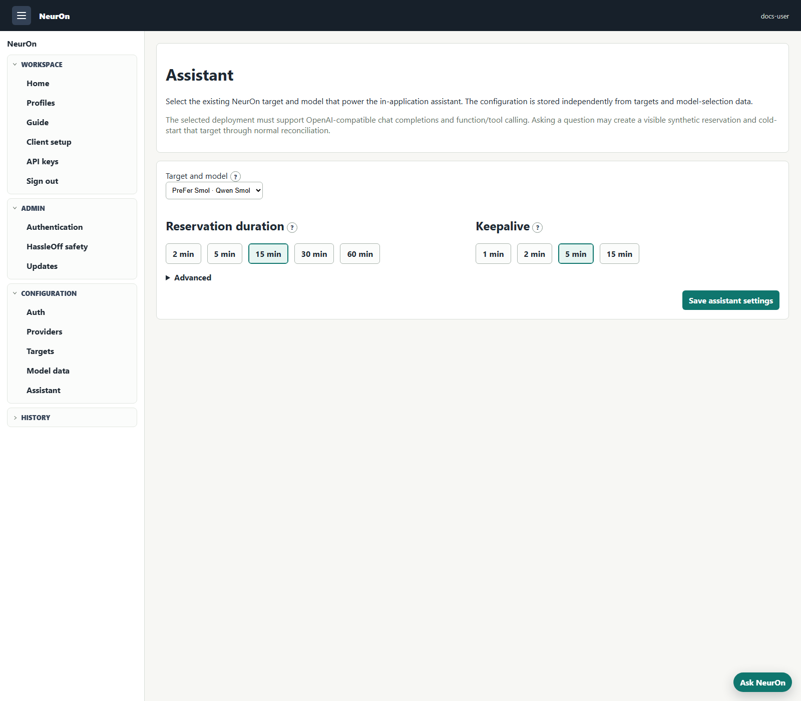

# Guided Model Selection

NeurOn recommends deployable **target-model pairs**, not abstract models. Cost,
context, runtime speed, hosting shape, aliases, and quantization quality can
differ when the same base model is served on different targets. An absent
measurement remains unknown.

## User controls

The profile builder separates hard requirements from preferences.

Hard requirements are:

- minimum effective context window;
- maximum target hourly cost;
- dedicated or multi-model hosting; and
- every selected binary technical capability, such as vision or tool use.

Scored strengths such as coding, math, and reasoning are preferences. Selecting
several of them refines the Intelligence dimension; a missing strength score
reduces data coverage rather than removing the deployment.

An unknown value does not satisfy a corresponding hard requirement. Estimated
quality retained is intentionally display-only: it is useful context, but the
measurement methods are not consistent enough to make it a safe eligibility
gate.

The profile builder opens in **Browse & filter** mode. Users can search model
and target names, IDs, aliases, and capabilities, then sort by fit, favorites,
profile usage, name, cost, Intelligence, or Speed. **Help me choose** opens the
optional **Good / Fast / Cheap** triangle wizard. It controls the internal
Intelligence / Speed / Cost weights and shows its magnetic snap points at the
center, category corners, and balanced edge positions. Everywhere outside the
triangle uses the formal Intelligence, Speed, and Cost names. The current
leader for each formal category appears beside the triangle.

Intelligence uses the model's 0–100 score, refined by selected scored strengths.
Speed compares the deployment against the fastest eligible measurements and
weights decode throughput at 80% and prefill throughput at 20%; first-token
latency is diagnostic only. Cost compares the deployment with the least
expensive eligible target. Missing preference data reduces data coverage rather
than becoming an invented zero. Every card shows its live fit score and data
coverage, and both model cards and target cards reorder as the triangle moves.
Applying a recommendation only fills the profile form; the user must still save
the profile and later reserve capacity.

## Durable operator data

Capability and deployment measurements are application data. Admins edit them
at **Admin > Model data** or through the authenticated admin APIs; they are not
environment variables and are not reloaded from a release manifest.

```text
PUT /api/admin/model-metadata/models/:modelId
PUT /api/admin/model-metadata/deployments/:targetId/:modelId
PUT /api/admin/targets/:targetId/models/:modelId/aliases
```

The durable data has two levels:

- `models` contains artifact facts shared by every deployment of one canonical
  NeurOn model ID: overall intelligence, lowercase scored-strength slugs,
  quantization format, measured quality retention, and provenance.
- `deployments` contains measured performance for one exact `targetId` +
  `modelId`, with provenance. Serving context and LiteLLM aliases remain on the
  target's model definition or its runtime-discovery snapshot.

Scores are validated from 0 through 100. Context and positive performance
values are validated as finite positive numbers. Unknown canonical model IDs
and target/model pairs that NeurOn cannot actually select fail closed.
Provenance supports source, source URL, stable source model ID, retrieval time,
version, and notes.

Do not commit licensed benchmark values or deployment-private measurements.
An authorized assistant can speed up manual data entry, but an operator must
review the values and record the source identifier, methodology version, and
retrieval date. NeurOn's schema and UI do not grant redistribution rights for
third-party data.

## Context and quantization

NeurOn uses configured or runtime-discovered serving context. When the runtime
reports one shared context plus concurrency, NeurOn uses the explicit
per-sequence value or divides the shared context by the concurrent sequence
count. Training context is not treated as serving context, and Model data does
not duplicate a separate context override.

`qualityRetentionPercent` means a measured score for the canonical artifact
against a named reference on a controlled harness. NeurOn does not estimate
retention from `Q4`, `FP8`, a filename, parameter count, or model family. When
no such measurement exists, show the quantization format and leave retention
unknown.

## Direct speed benchmark

**Discover models now** and **Rediscover all** can run the 50K-class
`neuron-speed-v2-50k` benchmark after the target is activated and discovery has
identified the runtime model IDs. The suite runs targets sequentially for the
bulk operation. For every model it:

- sends one discarded 50K-class warm-up request;
- sends three measured 50K-class requests with leading unique markers and
  prompt caching disabled;
- rejects a run if the runtime reports that it processed fewer than 40K prompt
  tokens;
- records median prefill and decode throughput; and
- persists the result and suite provenance on the exact target-model record.

The benchmark calls the already-activated target directly and is never a
startup side effect or a target-configuration operation. Only aggregate timing
measurements are stored. Operators should run it during an appropriate capacity
window because it generates inference work. A failure leaves the previous
durable measurement intact and is reported to the operator.

Ordinary LiteLLM traffic may still contribute a short-lived observational
overlay when it supplies unambiguous token/timing data. Cache hits, failed or
duplicate records, invalid timestamps, zero-token records, and routes that map
to more than one target are excluded. The durable direct benchmark remains the
repeatable baseline after restart.

## NeurOn-backed profile assistant

An administrator selects one existing target/model deployment at **Admin >
Assistant**. The selection is stored in a singleton `assistant_config` record,
independent of target definitions and Model data; it is not an
environment-configured external endpoint. Asking for help creates or
refreshes a synthetic `profile-advisor` reservation, waits for the ordinary
reconciler and health checks, and calls that target's OpenAI-compatible API.
This means the first request may cold-start the configured target. The admin
setting controls reservation duration, keep-alive, warm-model response timeout,
and optional trusted local system guidance. The reservation duration is the
maximum cold-start wait. Once a cold target becomes healthy, its first
completion receives another response window equal to the reservation duration;
an already-warm target uses the separate warm-model response timeout. The
selected runtime
must expose OpenAI-compatible chat completions;
function/tool-call support is required for screen updates and action proposals.
Operator guidance is sent to the selected model; do not put credentials,
licensed benchmark data, or private source material in it.



The assistant receives a sanitized deployment catalog (IDs, display names,
aliases, selection measurements, context, and cost), saved-profile IDs/names,
and the user's active reservation summary. It also receives an application-
constructed current-screen snapshot: a named surface such as Home, Profile
create/edit, Client setup, or an admin area; the route and title; and only the
relevant typed controls such as the current profile draft, requirement filters,
ranking shares, selected Home profile/timing, or Client setup profile. This lets
it answer “what am I looking at?” and update the right controls without sending
HTML or scraping visible text. It never receives target endpoints, provider or
model credentials, raw DOM contents, prompt logs, hidden fields outside the
explicit snapshot, unrelated private state, or another user's reservations.
Requests and model responses are not persisted by NeurOn. The browser keeps the
current conversation and pending confirmation in per-user session storage so
they survive full-page navigation; **Clear** removes that browser-side history.
It sends bounded prior user, Assistant, and application-context turns. Older
turns are compacted into a bounded summary while recent turns remain verbatim.

The invariant operating prompt and sanitized deployment catalog stay at the
front of every request to preserve the model host's prefix-cache opportunity.
The first conversation turn receives a structured screen/user-state snapshot;
later turns receive only an application-computed delta when that state changes.
Browser/user state is marked as untrusted descriptive context, never as prompt
instructions. Administrators may reveal a privacy-safe **Debug** panel in the
drawer to inspect history size, context snapshot/delta behavior, warm versus
cold acquisition, response timeout, attempt count, selected tool, and elapsed
time. It deliberately omits prompt text, catalog values, credentials, endpoints,
and model response content.

The system prompt explains the target/model/profile/reservation relationships,
reconciler ownership of provider lifecycle, health and model preparation,
duration, keep-alive and synthetic traffic demand, hard requirements, ranking
preferences, alias routing, screen-context trust boundaries, and confirmation
rules. The model must use an allowlisted tool:

- `configure_profile` fills reversible browser controls and exact target/model
  selections.
- `open_page` points to and follows an allowlisted ordinary NeurOn page.
- `save_profile` creates a confirmation card. Only the user's confirmation
  invokes the normal profile service.
- `start_reservation` is separate and requires another confirmation before it
  creates demand.
- Admins additionally receive safe navigation and confirmed target rediscovery
  tools. Destructive target/provider/update controls are not exposed.

The assistant drawer is available throughout authenticated pages and collapses
to a small launcher. Enter sends and Shift+Enter inserts a line break. A draft
created outside the profile builder is held in session storage and applied when
the user opens the builder. Navigation tools first pulse and point to the link
they will follow; reversible form tools fill and highlight the corresponding
controls. Confirmed save/start actions similarly identify the ordinary UI
control before calling the existing application API. If the backend is
unconfigured or unavailable, local search, requirements, sorting, and the
optional wizard remain usable.

`GET /api/profile-advisor/status` reports availability. The browser starts a
request with `POST /api/profile-advisor/requests` and polls the owner-scoped
`GET /api/profile-advisor/requests/:id`. This short-request flow can report
sleeping/waking and thinking states without holding one ALB connection open
through a cold start. The synchronous `POST /api/profile-advisor` remains a
compatibility surface. Completion replies accept current tool calls, legacy
function calls, and ordinary explanatory content. An empty or malformed reply
gets one schema-forced repair attempt; transient 408/425/429/502/503/504
responses get one short retry when the request deadline permits. Assistant tool
calls do not bypass normal authorization, maintenance mode, validation, or user
confirmation.

## PreFer boundary

A PreFer release manifest is not required. PreFer may later publish exact
artifact, quantization, context, and benchmark measurements in this schema, but
NeurOn continues to own durable model data, local cost, direct measurements,
filtering, ranking, and user confirmation.
