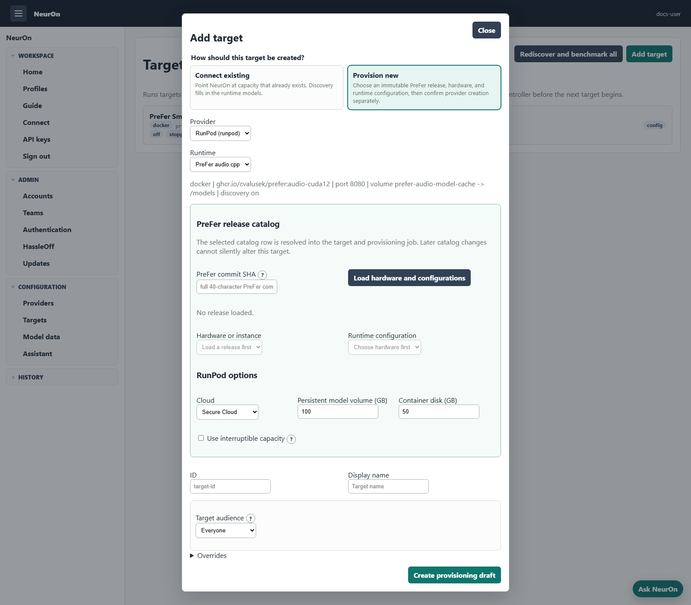

# Targets

A target is the reservable runtime capacity unit. It answers: which runtime can
serve which models, and what resource-specific config is needed to operate it?

Targets can be declared in JSON/env config or stored in the persistence layer.
Declarative targets are read-only in the admin UI. Persisted targets can be
created and deleted from `/admin/targets`.

Important fields:

- `id`
- `displayName`
- `provider`: provider type, such as `docker`, `runpod`, or `aws-ecs-asg`
- `providerId`: configured provider instance; defaults to `provider`
- `modelIds` and optional detailed `models`
- optional positive `aliasPriority`: lower values win global LiteLLM
  model-group alias collisions; later targets become formal fallbacks
- optional `audience`: `global`, selected durable team IDs, or selected durable
  user IDs; omitted targets are global
- provider-specific resource config, such as `docker`, `runpod`, `aws`, or `neuron`
- `healthUrl` and `apiUrl` overrides
- optional `modelDiscovery`

Provider relationships are direct: a target should reference the provider
instance that owns it. Shared account/endpoint details belong on the provider;
resource identifiers belong on the target.

Hosting mode is derived, not configured: one known model is a dedicated target,
more than one is a multi-model host, and an empty catalog remains unknown until
discovery. The same derived value powers the profile requirement filter.

Persisted target models can carry operator-managed aliases in addition to
runtime-discovered IDs. NeurOn keeps one canonical LiteLLM deployment for the
exact target/model, maps scoped `<target>/<alias>` and global friendly names to
it with LiteLLM model-group aliases, and makes the lowest-priority-number target
the global alias owner. Later targets form the fallback chain. The same names
appear in profile selection and **Connect**.

Audience filtering is an authorization boundary, not only a display hint. It
is enforced in the UI, REST API, MCP catalog and tools, reservation validation,
and LiteLLM traffic attribution. A parent-team audience includes members of its
nested descendant teams. Persisted user audiences are rewritten by a confirmed
duplicate-account merge; configured audiences continue to resolve the disabled
source ID through its canonical merge alias. Providers remain installation-
global in this release. See [Identity and Access](identity-access.md).

## Runtime Profiles

Runtime profiles are plugin-owned descriptions of runnable software. They keep
portable runtime defaults and release-catalog behavior outside provider
payloads. NeurOn includes two PreFer runtimes:

```json
{
  "id": "prefer",
  "name": "PreFer llama.cpp",
  "type": "docker",
  "image": "ghcr.io/cvalusek/prefer:latest",
  "volumes": {
    "/models": "prefer-model-cache"
  }
}
```

`prefer-audio` describes PreFer audio.cpp with model and voice volumes. Both
profiles define a release inventory that turns a full 40-character PreFer
source commit into a finite, provider-compatible deployment catalog. NeurOn
validates the catalog schema and fingerprint, then stores the exact release,
deployment, image, environment, hardware, and model set on the target. A future
catalog update never silently changes an existing target.

For Docker-style profiles, `port`, `health`, `api`, and `discovery` have
defaults: `8080`, `/health`, `/v1`, and `true`. The `volumes` map is keyed by
runtime container path, with the backing volume name as the value. Provider
adapters translate that portable shape into provider-specific mount syntax.
Docker provisioning currently creates containers with all GPUs available by
default.

The target creation UI begins with the operator's intent:

- **Connect existing** records an already-running endpoint and relies on
  discovery for facts the runtime can report.
- **Provision new** selects a provider, runtime, full source commit,
  provider-compatible hardware/instance, and one catalog deployment. Saving
  creates an immutable draft; a second, explicitly confirmed action creates
  billable provider capacity.

RunPod receives the catalog image, GPU/card, storage, port, and environment
plan. AWS receives the catalog instance type and a provider-owned Launch
Template; NeurOn changes only the marked deployment environment block in that
template's user data. See [Provisioning](provisioning.md) and
[PreFer integration](prefer.md).



Runtime profiles can also define variants. A variant is a named flavor of the
base profile. The target creation UI exposes variants when the selected profile
declares them and applies the variant's overrides before creating provider
specific target config.

Variants are intentionally smaller than the release catalog. They preserve
deliberate compatibility presets for connected/manual deployments; they are not
a production inventory or a substitute for a pinned catalog selection.
Per-target operator settings, provider-specific creation options, and secret
handling still belong in explicit target or provider configuration.
