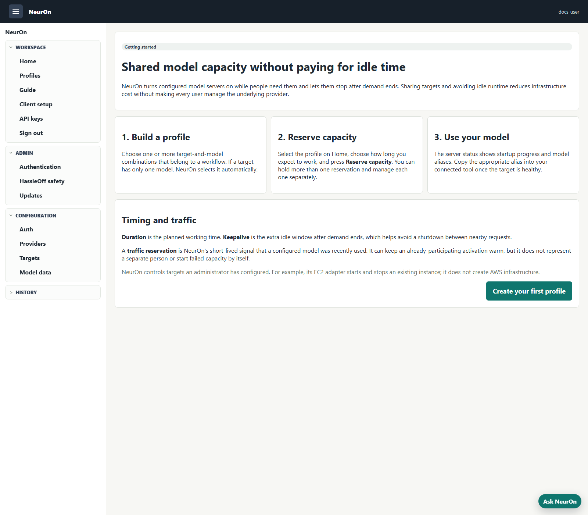
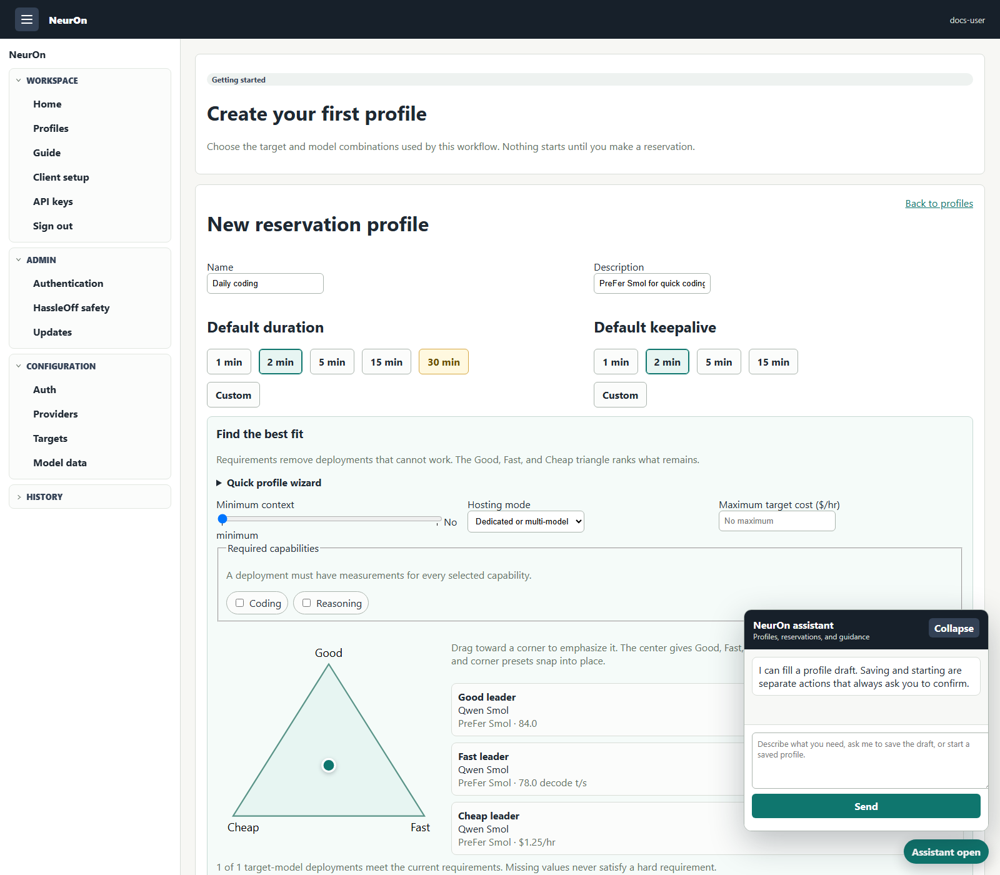
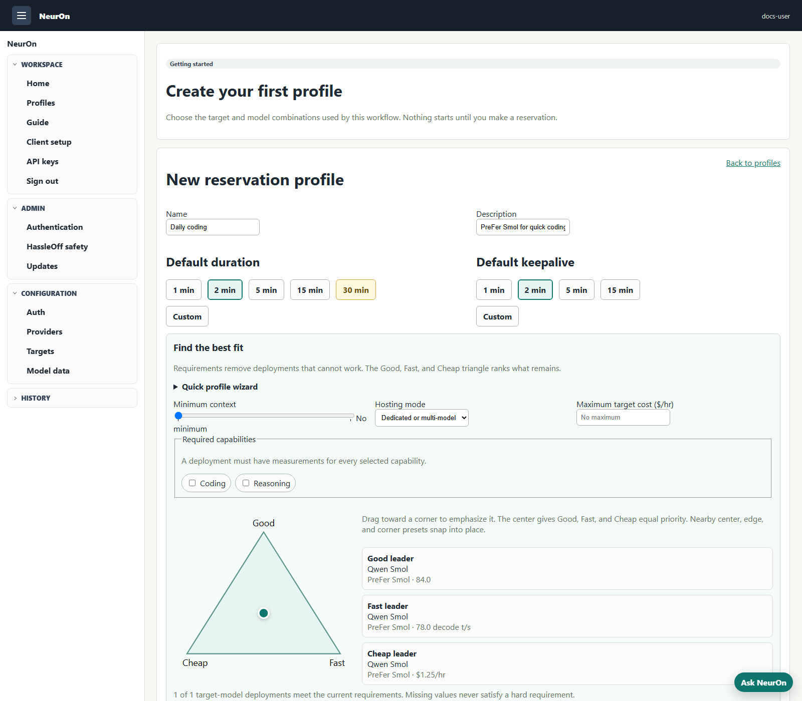
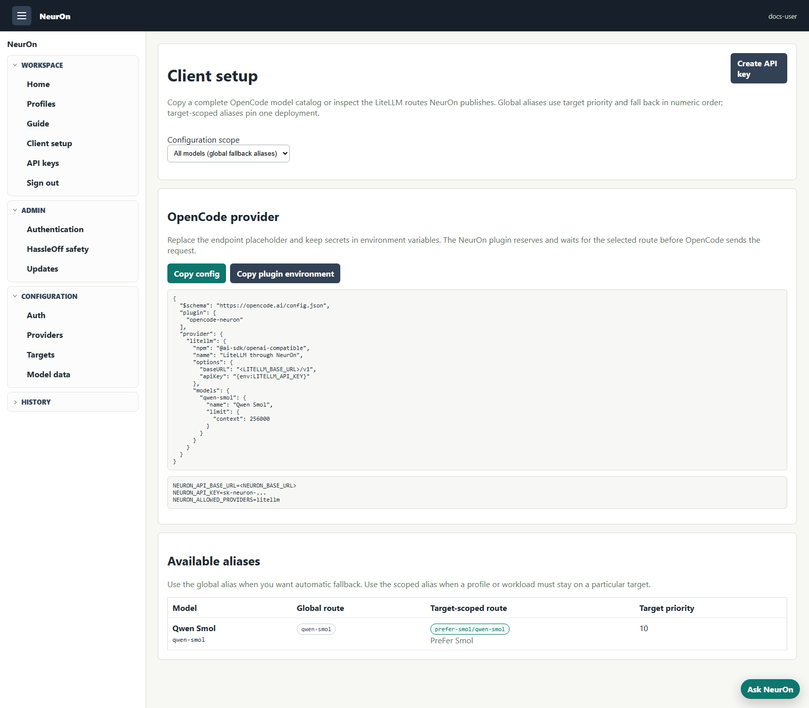

# User guide

NeurOn helps a team share expensive LLM runtime capacity without leaving it on
all the time. You say what you need and for how long; NeurOn combines your
demand with everyone else's, keeps the required target available, and turns it
off only when nobody or no recent traffic still needs it.

## First login

If you have no reservation profiles or active reservations, Home opens a short
explanation before profile creation. **Guide** remains available in the
navigation afterward.

## Create or edit a profile

A profile is a reusable reservation shape. Give it a recognizable name, choose
one or more targets, and select the models you expect to use on each target.
Creation and editing use dedicated pages rather than a modal.

Use the selector when the model list is unfamiliar:

- Set minimum context first when it is a real workload requirement. An unknown
  context does not pass the filter.
- Add every required capability tag, a budget ceiling, or a dedicated versus
  multi-model host requirement only when it is truly mandatory.
- Move the **Good**, **Fast**, and **Cheap** point to express preferences among
  the choices that remain. The center means maximum, equal preference for all
  three. Useful balanced positions and category corners snap into place.
- The quick wizard sets requirements and internal preferences. The collapsible
  NeurOn assistant can also fill the complete draft, including exact
  target/model choices. Its save and start tools always present separate
  confirmation cards before anything is persisted or capacity demand begins.
- Review the ranked cards and category leaders, then select the exact
  target-model choices the profile needs.

Speed is target-specific: decode throughput carries 75% of its score and
prefill throughput carries 25%. Time to first token is diagnostic only and does
not affect ranking. Missing measurements reduce displayed data coverage rather
than counting as a poor score. **Estimated quality retained** appears only when
an operator supplied a measured result for the exact artifact and is not a
filter.

The context slider uses effective per-request context. If a runtime shares one
context across concurrent sequences, the card identifies that concurrency and
does not advertise the entire shared context to every request. Model cards also
show favorites, profile use, recent reservation use, intelligence, speed, cost,
and LiteLLM aliases when those facts are known.

- If a target exposes one model, NeurOn selects it automatically.
- If a target exposes several models, choose at least one. This prevents a
  reservation from waking an expensive target without recording its intent.
- A profile may include several target/model combinations. Use that for a
  workflow that genuinely needs multiple backends together; otherwise keep the
  profile small so its cost and intent stay obvious.

The profile also stores default duration and keepalive values. You can override
both immediately before making any reservation.

## Reserve capacity

On Home, select a profile and review the visible duration and keepalive choices.
Changing profiles immediately updates both controls to that profile's defaults.

- **Duration** is how long your reservation contributes demand, even if no
  traffic appears.
- **Keepalive** is how long recent observed traffic may keep an already-needed
  target available after direct demand ends. It is not additional guaranteed
  reservation time.
- **Estimated cost** covers the selected targets for duration plus keepalive at
  their configured or provider-reported hourly estimates. It is an operational
  estimate, not a cloud-provider invoice.

Duration choices shorter than the target's average startup time plus two minutes
are shown in red because little useful time may remain after startup. Thirty
minutes is shown in amber as a visual reminder that it is a longer commitment;
there is no confirmation popup. Keepalive is not part of that warning.

The reserve action stays visible in the reservation panel with the cost summary.
Once submitted, your reservation appears at the top of Home with extend and end
controls.

## Manage several reservations

Home lists every active reservation you own. Each has its own remaining time,
profile, models, projected cost, quick extensions, and **I'm done** action.
Ending one reservation does not stop capacity still required by another user or
reservation.

Server status is grouped by target. Personally reserved targets come first,
followed by other activated targets and then off targets. Within those groups,
recently used targets appear first. A multi-target reservation can appear under
more than one target while remaining one reservation. Expanding a target stays
expanded across polling, so controls and traffic help text remain usable.

## Configure OpenCode and other clients

Open **Client setup** to see every callable LiteLLM name. A global alias points
to the lowest-priority-number target. The scoped `<target>/<alias>` form always
selects that exact target/model deployment. Choose a profile to limit the list,
then copy the generated OpenCode provider JSON and use the displayed model names
instead of manually reconstructing them.

## Traffic reservation and cost

When LiteLLM traffic polling is configured, recent requests can create a short
synthetic traffic reservation. This signal protects a healthy target from being
stopped between closely spaced requests; it cannot wake a failed target on its
own and is not attributed as a user reservation.

During a traffic-only tail, estimated cost remains allocated to the real
reservations that participated in that target activation. New real demand
becomes the owner of subsequent allocation. Until user identity is available in
the traffic source, the activation participants are the fairest durable link.

## When capacity is not ready yet

Reservation creation records intent; it does not promise the runtime is already
healthy. Watch Server status for `starting`, `healthy`, or a failure message.
For a pre-created EC2 target that AWS is still stopping, NeurOn keeps the
reservation active, waits for `stopped`, and starts it on a later reconciliation
pass. It does not repeatedly issue an invalid start request.

If a target reports a provider failure, NeurOn fails the affected reservations
rather than pretending the capacity is usable. Contact an operator with the
target name and visible status message; never share an API key.
